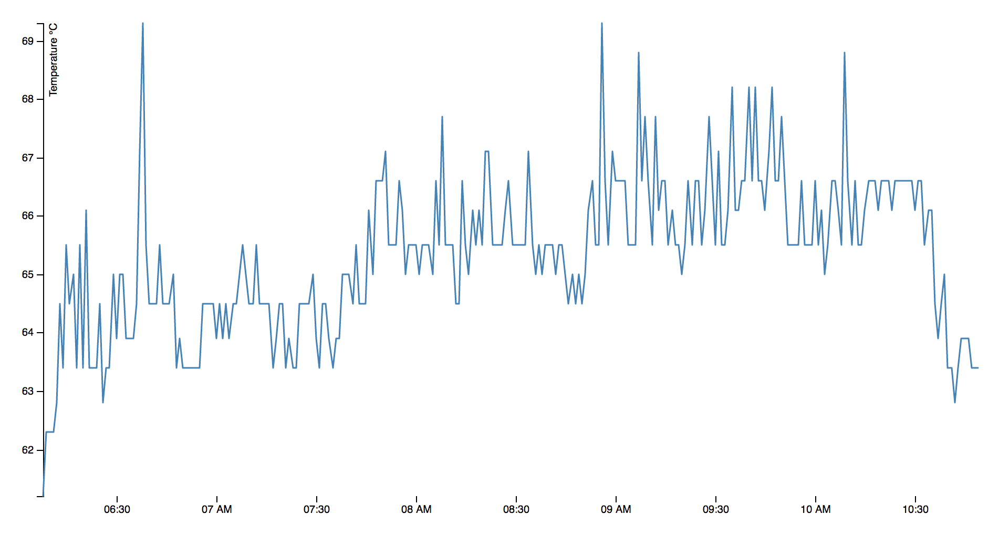

# Raspberry Pi Temperature Monitor

This project consists of 2 python scripts that can be run on a raspberry pi that measure the temperature of the pi and report the data to [Firebase](https://firebase.google.com/).

## Installation

### Scripts

You will need to copy the two scripts to your pi. One easy way would be to just clone this repo.

### Config

You will need to rename the `config.json.example` to be `config.json` and fill in your specific information.

### Cron Scheduling

You also need to set up the scripts to run on a regular basis. To do this, you should use `crontab`.

1. On the pi, enter `crontab -e`
2. Use the following cron settings, or adjust to report as frequently as you want.

```
* * * * * python /home/pi/temperatureMonitor/temp_monitor.py
0 * * * * python /home/pi/temperatureMonitor/roll_firebase_logs.py
```

This will record the temperature every minute (first line), and check if the logs need to roll every hour (second line). Note that the `roll_firebase_logs.py` will check the last time it rolled first, and only update as often as defined in that script.

Make sure the paths defined point to your scripts.

## Scripts

The first script, `temp_monitor.py` just measures the internal temperature using `vcgencmd`, logs it to a file, and posts it to firebase. The logging will just go to your home directory in a file called 'cpu_temp_log.tsv'.

The second script, `firebase_log_roll.py` is used so you don't keep too much data in firebase by removing old data. By default, it will delete that data once a day, so at most you'll have about two days of data, and at a minimum you'll have one.

## Graph

In addition to recording the temperature, I also have a simple HTML page that uses D3 to graph the temperature. It pulls data directly from Firebase to plot a simple line chart.



If you are going to use this, make sure you update the Firebase URL with the correct project and auth in this line:

`d3.json("https://<project>.firebaseio.com/temperature/<pi_name>/temperatures.json?auth=<auth>", function(error, json) {`

## Firebase

To use this you will need to setup a Firebase project. In the code the `pi-temperature-c369d` is a sample project I used for testing.

### Firebase Auth

You will need a database secret to use as `auth`. Note that the `ItdM8YVCzL5YBbiEM2sSax92JhficBxvFPPKBzXz` value I have throughout the code is a revoked auth secret I used for testing.

Under [Gear] > Project Settings > Service Accounts > Database Secrets

### Firebase Rules

Under Database > Rules:

```{
  "rules": {
    ".read": "auth != null",
    ".write": "auth != null"
  }
}```

## Python Dependencies

### pip

This isn't strictly required, but it is the easiest way to get the `requests` python package. More information on `pip` can be found here: [website](https://pip.pypa.io/en/stable/)

To install `pip` on the raspberry pi:

1. `wget https://bootstrap.pypa.io/get-pip.py`
2. `sudo python get-pip.py`

### requests library
The `requests` python package is used to make the REST API calls to Firebase. More information can be found here: [website](http://docs.python-requests.org/en/master/)

Assuming you have `pip` installed, all you need to do is:

1. `sudo pip install requests`
